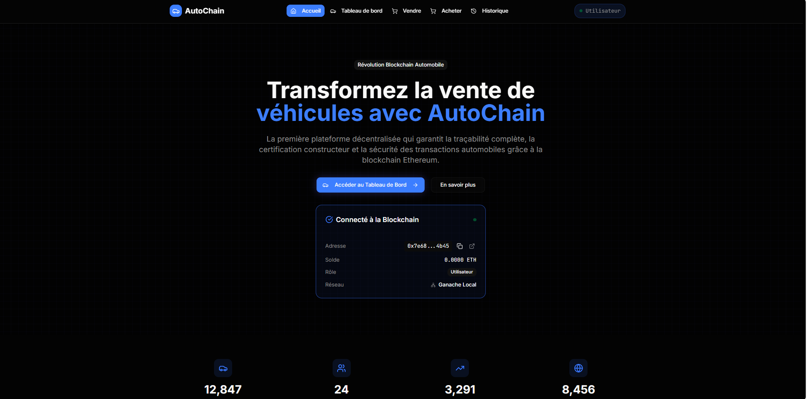

# AutoChain - Configuration et Déploiement des Constructeurs



## Vue d'ensemble

AutoChain est une application décentralisée (DApp) de gestion de véhicules sur blockchain. Ce README explique comment configurer et certifier les constructeurs automobiles dans le système.

---

## Prérequis

- Node.js v16 ou supérieur
- npm ou yarn
- Ganache ou un autre réseau Ethereum
- Contrat AutoChain déployé
- Clé privée de l'administrateur du contrat

---

## Fonctionnalités

### Authentification MetaMask
- Connexion sécurisée via MetaMask
- Détection automatique du rôle utilisateur (Constructeur, Vendeur, Acheteur)
- Gestion des permissions basée sur les rôles

### Pour les Constructeurs
- Création et certification de nouveaux véhicules
- Enregistrement des données techniques sur la blockchain
- Gestion des véhicules certifiés

### Pour les Vendeurs/Propriétaires
- Mise en vente de véhicules possédés
- Définition des prix en ETH
- Gestion du portefeuille de véhicules

### Pour les Acheteurs
- Navigation et recherche de véhicules disponibles
- Achat sécurisé via smart contracts
- Vérification de l'historique complet

### Traçabilité Complète
- Historique transparent de tous les propriétaires
- Certification constructeur vérifiable
- Transactions immuables sur la blockchain

---

## Configuration

### 1. Installation

```bash
# Cloner le projet et installer les dépendances
cd autochain-dapp
npm install

# Installer dotenv pour les scripts
npm install dotenv
```

### 2. Configuration des variables d'environnement

Copiez le fichier d'exemple et configurez vos variables :

```bash
cp .env.example .env
```

Éditez le fichier `.env` avec vos valeurs :

```env
# ================================
# BLOCKCHAIN NETWORK CONFIGURATION
# ================================
NEXT_PUBLIC_NETWORK_NAME=Ganache Local
NEXT_PUBLIC_RPC_URL=http://127.0.0.1:7545
NEXT_PUBLIC_CHAIN_ID=1337

# ================================
# SMART CONTRACT CONFIGURATION
# ================================
NEXT_PUBLIC_CONTRACT_ADDRESS=0x8E30414c9E14FAAC56303BAE6a045Aa20Ad65b3A

# ================================
# ADMIN CONFIGURATION
# ================================
ADMIN_PRIVATE_KEY=0x882f783cfe5181d8174aed29d7803499b5200f3cd867f848c91e26f4c112d328

# ================================
# CONSTRUCTORS CONFIGURATION
# ================================
CONSTRUCTOR_ADDRESSES=0x2f609E0C31aD4f3eE42ebEF47cF347D198deE998,0x390953dfBD34bC86C6Fb9Acfd137606FfA0c4bAa
CONSTRUCTOR_NAMES=Tesla,BMW
CONSTRUCTOR_DESCRIPTIONS=Constructeur Tesla officiel,Constructeur BMW officiel

# Client-side (pour l'interface)
NEXT_PUBLIC_CONSTRUCTOR_ADDRESSES=0x2f609E0C31aD4f3eE42ebEF47cF347D198deE998,0x390953dfBD34bC86C6Fb9Acfd137606FfA0c4bAa
NEXT_PUBLIC_CONSTRUCTOR_NAMES=Tesla,BMW
NEXT_PUBLIC_CONSTRUCTOR_DESCRIPTIONS=Constructeur Tesla officiel,Constructeur BMW officiel
```

### 3. Variables d'environnement expliquées

| Variable | Description | Exemple |
|----------|-------------|---------|
| `NEXT_PUBLIC_NETWORK_NAME` | Nom du réseau blockchain | `Ganache Local` |
| `NEXT_PUBLIC_RPC_URL` | URL du noeud RPC | `http://127.0.0.1:7545` |
| `NEXT_PUBLIC_CHAIN_ID` | ID de la chaîne blockchain | `1337` |
| `NEXT_PUBLIC_CONTRACT_ADDRESS` | Adresse du contrat AutoChain | `0x8E30...` |
| `ADMIN_PRIVATE_KEY` | Clé privée de l'admin du contrat | `0x882f...` |
| `CONSTRUCTOR_ADDRESSES` | Adresses des constructeurs (serveur) | `0x2f60...,0x3909...` |
| `CONSTRUCTOR_NAMES` | Noms des constructeurs | `Tesla,BMW` |
| `CONSTRUCTOR_DESCRIPTIONS` | Descriptions des constructeurs | `Constructeur Tesla officiel,Constructeur BMW officiel` |
| `NEXT_PUBLIC_CONSTRUCTOR_*` | Versions client des variables constructeurs | Mêmes valeurs que les versions serveur |

---

## Technologies Utilisées

- **Frontend**: Next.js 14, React 19, TypeScript
- **Styling**: Tailwind CSS v4, Radix UI
- **Blockchain**: Ethereum, Ethers.js v6
- **Wallet**: MetaMask Integration
- **UI/UX**: Shadcn/ui, Lucide Icons

---

## Design

Interface moderne avec thème sombre professionnel inspiré des plateformes blockchain :

- Palette de couleurs : Bleu/Violet primaire, Vert accent
- Animations fluides et effets de survol
- Design responsive et accessible
- Grille blockchain animée en arrière-plan

---

## Architecture

```
app/
├── page.tsx                 # Page d'accueil avec connexion MetaMask
├── dashboard/               # Tableau de bord principal
├── create-car/              # Création de véhicule (Constructeurs)
├── sell-car/                # Mise en vente (Propriétaires)
├── buy-car/                 # Achat de véhicules (Acheteurs)
├── car/[id]/                # Détails d'un véhicule
├── history/                 # Historique global des transactions
└── layout.tsx               # Layout principal avec providers

components/
├── navigation.tsx           # Navigation responsive avec rôles
├── car-card.tsx             # Carte de véhicule avec actions
├── stats-overview.tsx       # Statistiques du tableau de bord
├── blockchain-status.tsx    # Statut de connexion blockchain
├── error-boundary.tsx       # Gestion d'erreurs
└── ui/                      # Composants UI réutilisables

lib/
├── web3.ts                  # Utilitaires Web3 et types
└── utils.ts                 # Utilitaires généraux

hooks/
└── use-web3.ts              # Hook personnalisé Web3
```

---

## Démarrage Rapide

1. **Installation des dépendances**

   ```bash
   npm install
   ```

2. **Configuration MetaMask**
   - Installer l'extension MetaMask
   - Se connecter à un réseau Ethereum (Mainnet, Sepolia, etc.)
   - Avoir des ETH pour les transactions

3. **Déploiement du Smart Contract**
   - Déployer le contrat `AutoChain.sol` sur le réseau choisi

4. **Lancement de l'application**

   ```bash
   npm run dev
   ```

5. **Accès à l'application**
   - Ouvrir http://localhost:3000
   - Connecter MetaMask
   - Commencer à utiliser AutoChain !

---

## Certification des Constructeurs

### Méthode Automatique (Recommandée)

Utilisez le script de configuration automatique :

```bash
node scripts/setup-constructors.js
```

Ce script va :
1. Valider la configuration depuis `.env`
2. Se connecter au réseau blockchain
3. Initialiser le contrat AutoChain
4. Certifier tous les constructeurs listés
5. Afficher un résumé des certifications

#### Exemple de sortie

```
AutoChain Constructor Setup
==============================
Validation de la configuration...
Configuration valide
Réseau: Ganache Local (http://127.0.0.1:7545)
Contrat: 0x8E30414c9E14FAAC56303BAE6a045Aa20Ad65b3A
Constructeurs à certifier: 2

Connexion au réseau...
Connecté au réseau Chain ID: 1337

Initialisation du contrat...
Admin du contrat: 0x742d35Cc6634C0532925a3b8D4C9db96590b5
Adresse du wallet: 0x742d35Cc6634C0532925a3b8D4C9db96590b5
Wallet admin vérifié

Certification des constructeurs...
Traitement: Tesla (0x2f609e0c31ad4f3ee42ebef47cf347d198dee998)
Certification de Tesla...
Transaction envoyée: 0xabc123...
Tesla certifié avec succès! Block: 15432
Vérification: Tesla est maintenant certifié

Traitement: BMW (0x390953dfbd34bc86c6fb9acfd137606ffa0c4baa)
Certification de BMW...
Transaction envoyée: 0xdef456...
BMW certifié avec succès! Block: 15433
Vérification: BMW est maintenant certifié

RÉSUMÉ FINAL
================
Tesla           0x2f609e0c31ad4f3ee42ebef47cf347d198dee998 CERTIFIÉ
BMW             0x390953dfbd34bc86c6fb9acfd137606ffa0c4baa CERTIFIÉ

Script terminé!
```

---

## Ajout de Nouveaux Constructeurs

### 1. Modifier le fichier .env

Ajoutez les nouvelles adresses, noms et descriptions (séparés par des virgules) :

```env
# Exemple avec 3 constructeurs
CONSTRUCTOR_ADDRESSES=0x2f609E0C31aD4f3eE42ebEF47cF347D198deE998,0x390953dfBD34bC86C6Fb9Acfd137606FfA0c4bAa,0x1234567890123456789012345678901234567890
CONSTRUCTOR_NAMES=Tesla,BMW,Mercedes
CONSTRUCTOR_DESCRIPTIONS=Constructeur Tesla officiel,Constructeur BMW officiel,Constructeur Mercedes officiel

# N'oubliez pas les versions NEXT_PUBLIC_ pour le frontend
NEXT_PUBLIC_CONSTRUCTOR_ADDRESSES=0x2f609E0C31aD4f3eE42ebEF47cF347D198deE998,0x390953dfBD34bC86C6Fb9Acfd137606FfA0c4bAa,0x1234567890123456789012345678901234567890
NEXT_PUBLIC_CONSTRUCTOR_NAMES=Tesla,BMW,Mercedes
NEXT_PUBLIC_CONSTRUCTOR_DESCRIPTIONS=Constructeur Tesla officiel,Constructeur BMW officiel,Constructeur Mercedes officiel
```

### 2. Relancer la certification

```bash
node scripts/setup-constructors.js
```

### 3. Redémarrer l'application

```bash
npm run dev
```

---

## Personnalisation de l'Interface

L'interface utilise des couleurs automatiques pour chaque constructeur. L'ordre des couleurs :

1. Rouge (Tesla par défaut)
2. Bleu (BMW par défaut)
3. Vert (Mercedes)
4. Violet
5. Orange
6. Cyan

Les logos doivent être placés dans `/public/` avec le format : `{nom-constructeur}-logo.png`

Exemple :
- `tesla-logo.png`
- `bmw-logo.png`
- `mercedes-logo.png`

---

## Résolution des Problèmes

### Erreur "Wallet n'est pas l'admin"

```
Ce wallet n'est pas l'admin du contrat
```
**Solution :** Vérifiez que `ADMIN_PRIVATE_KEY` correspond bien à l'admin du contrat.

### Erreur de connexion réseau

```
Impossible de se connecter au réseau
```
**Solutions :**
1. Vérifiez que Ganache est démarré
2. Vérifiez l'URL RPC dans `NEXT_PUBLIC_RPC_URL`
3. Vérifiez le Chain ID dans `NEXT_PUBLIC_CHAIN_ID`

### Erreur "Configuration invalide"

```
Erreurs de configuration:
   - CONSTRUCTOR_NAMES doit avoir le même nombre d'éléments que CONSTRUCTOR_ADDRESSES
```
**Solution :** Assurez-vous que tous les tableaux (addresses, names, descriptions) ont le même nombre d'éléments.

### Les constructeurs n'apparaissent pas dans l'interface

**Solutions :**
1. Vérifiez les variables `NEXT_PUBLIC_CONSTRUCTOR_*`
2. Redémarrez l'application après modification du `.env`
3. Vérifiez que les constructeurs sont bien certifiés avec le script

---

## Structure des Fichiers

```
autochain-dapp/
├── .env                    # Configuration principale
├── .env.example            # Modèle de configuration
├── scripts/
│   └── setup-constructors.js  # Script de certification
├── lib/
│   ├── web3.ts             # Utilitaires blockchain
│   └── constructors.ts     # Configuration constructeurs
└── public/
    ├── tesla-logo.png      # Logos des constructeurs
    └── bmw-logo.png
```

---

## Démarrage de l'Application

Une fois la configuration terminée :

```bash
# Démarrer l'application
npm run dev

# Ouvrir dans le navigateur
# http://localhost:3000
```
---

## Notes Importantes

- Ne jamais commiter le fichier `.env` (il contient des clés privées)
- Toujours utiliser `.env.example` comme modèle
- Garder les clés privées sécurisées
- Redémarrer l'app après modification du `.env`
- Les variables `NEXT_PUBLIC_*` sont visibles côté client

---

## Résumé Rapide

1. `cp .env.example .env`
2. Modifier `.env` avec vos valeurs
3. `node scripts/setup-constructors.js`
4. `npm run dev`
5. Ouvrir http://localhost:3000

---

## Roadmap

- [ ] Intégration IPFS pour les images de véhicules
- [ ] Support multi-chaînes (Polygon, BSC)
- [ ] Système de réputation des vendeurs
- [ ] API pour intégrations tierces
- [ ] Application mobile React Native

---

## Contribution

Les contributions sont les bienvenues ! Veuillez :

1. Fork le projet
2. Créer une branche feature
3. Commit vos changements
4. Push vers la branche
5. Ouvrir une Pull Request

---

## Licence

Ce projet est sous licence MIT.

---

## Support

Pour toute question ou problème :

- Ouvrir une issue sur GitHub
- Consulter la documentation technique
- Nous contacter par email : [ibrahim.elghali@outlook.com](mailto:ibrahim.elghali@outlook.com), [hamzazarai11@gmail.com](mailto:hamzazarai11@gmail.com), ou [fbouattour.2001@gmail.com](mailto:fbouattour.2001@gmail.com)

